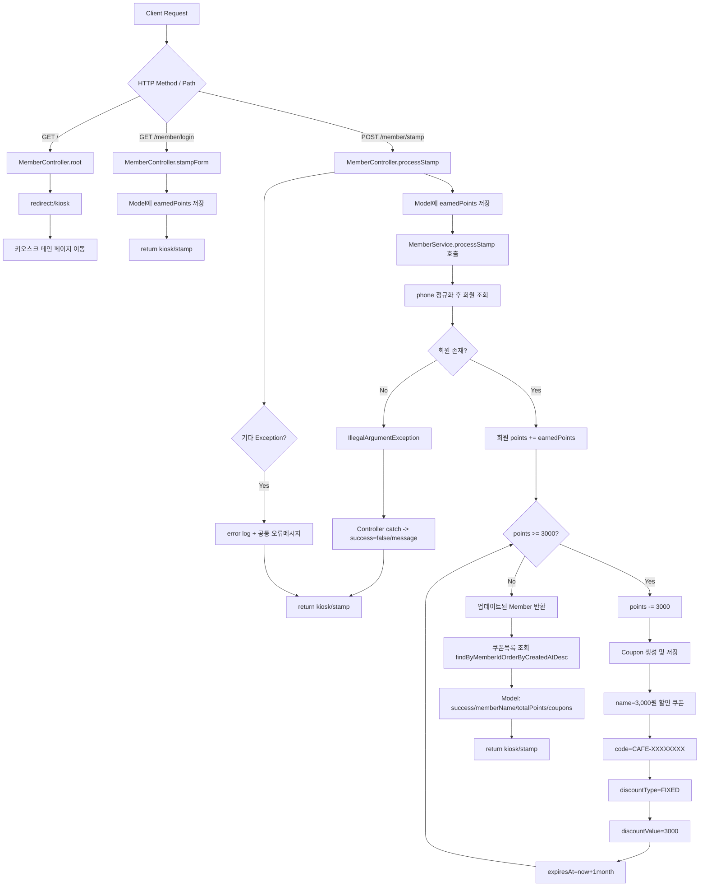
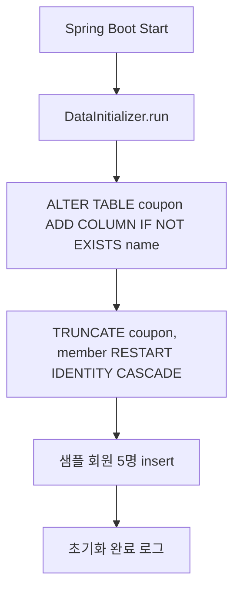

# MiniProject 엔드포인트 실행 흐름 (Mermaid)

아래 다이어그램은 현재 Java 코드 기준으로 실제 매핑된 엔드포인트 흐름입니다.

---

## 보조 흐름: 앱 시작 시 DB 초기화

---

## 참고

- 현재 코드베이스의 컨트롤러 기준 실제 Java 매핑 엔드포인트:
  - `GET /`
  - `GET /member/login`
  - `POST /member/stamp`
- 템플릿/JS에는 관리자/키오스크 관련 경로가 더 보이지만, Java 컨트롤러 매핑은 별도 파일 존재 여부에 따라 달라질 수 있습니다.
