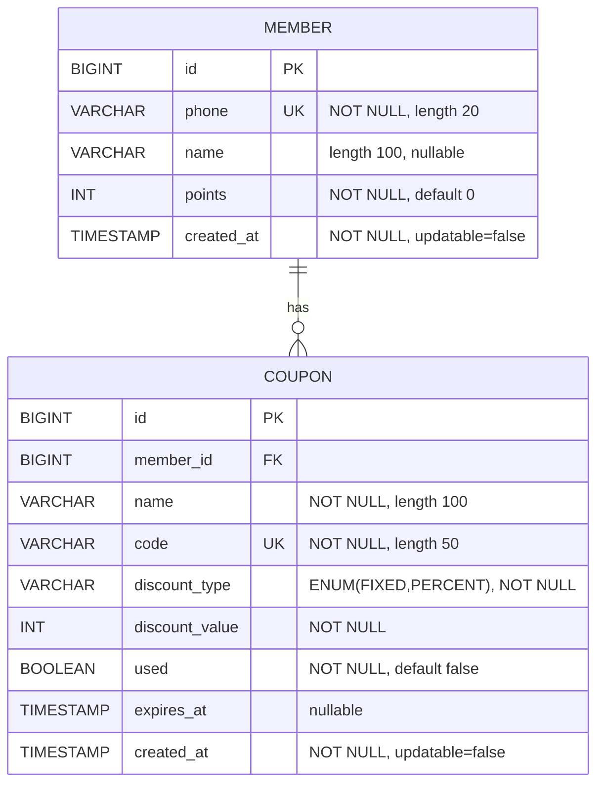
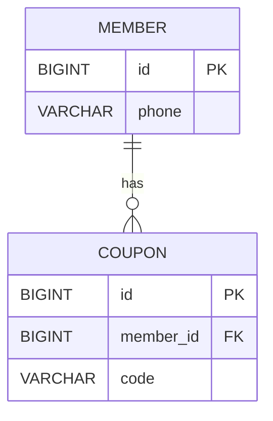

# MiniProject 엔티티 ERD

현재 Java 엔티티(`Member`, `Coupon`) 기준 ERD입니다.



---

## 관계 설명

- `Member (1) : Coupon (N)`
- 한 회원은 여러 쿠폰을 가질 수 있습니다.
- 각 쿠폰은 하나의 회원(`member_id`)에 속합니다.



예시 데이터 (member.id = 1 회원이 쿠폰 2개를 가진 경우, JOIN 결과):

```sql
SELECT m.id   AS member_id,
       m.phone,
       c.id   AS coupon_id,
       c.member_id,
       c.code
FROM member m
JOIN coupon c ON c.member_id = m.id
WHERE m.id = 1;
```

| member_id | phone         | coupon_id | member_id (FK) | code       |
|----------:|--------------|----------:|----------------|-----------|
|         1 | 010-1111-2222|        10 | 1              | CAFE-AAAA |
|         1 | 010-1111-2222|        11 | 1              | CAFE-BBBB |

즉, **member 테이블의 id=1 한 행(회원 한 명)에 대해, coupon 테이블에서 그 회원을 가리키는 행(쿠폰)이 여러 개 매칭되어 한 테이블로 보이게 됩니다.**

---

## 코드 매핑 참고

### Supabase(PostgreSQL) DDL

```sql
CREATE TABLE IF NOT EXISTS member (
    id         BIGSERIAL PRIMARY KEY,
    phone      VARCHAR(20)  NOT NULL UNIQUE,
    name       VARCHAR(100),
    points     INT          NOT NULL DEFAULT 0,
    created_at TIMESTAMP    NOT NULL DEFAULT CURRENT_TIMESTAMP
);

CREATE TABLE IF NOT EXISTS coupon (
    id             BIGSERIAL PRIMARY KEY,
    member_id      BIGINT       REFERENCES member(id),  -- FK: coupon.member_id → member.id
    code           VARCHAR(50)  NOT NULL UNIQUE,
    discount_type  VARCHAR(10)  NOT NULL CHECK (discount_type IN ('FIXED', 'PERCENT')),
    discount_value INT          NOT NULL,
    used           BOOLEAN      NOT NULL DEFAULT FALSE,
    expires_at     TIMESTAMP,
    created_at     TIMESTAMP    NOT NULL DEFAULT CURRENT_TIMESTAMP
);
```

### Member 엔티티 (1 쪽)

```java
@Entity
@Table(name = "member")
@Getter
@Setter
@NoArgsConstructor
@AllArgsConstructor
@Builder
public class Member {

    @Id
    @GeneratedValue(strategy = GenerationType.IDENTITY)
    private Long id;

    @Column(nullable = false, unique = true, length = 20)
    private String phone;

    @Column(length = 100)
    private String name;

    @Column(nullable = false)
    @Builder.Default
    private int points = 0;

    @Column(name = "created_at", nullable = false, updatable = false)
    private LocalDateTime createdAt;

    @PrePersist
    protected void onCreate() {
        if (createdAt == null) {
            createdAt = LocalDateTime.now();
        }
    }
}
```

- 회원을 나타내는 엔티티이고, 기본키 `id` 가 쿠폰 테이블의 `member_id` 에 의해 참조됩니다.
- 코드상에는 쿠폰 컬렉션을 들고 있지 않지만, DB 의 FK 덕분에 **Member(1) : Coupon(N)** 관계가 형성됩니다.

### Coupon 엔티티 (N 쪽)

```java
@Entity
@Table(name = "coupon")
@Getter
@Setter
@NoArgsConstructor
@AllArgsConstructor
@Builder
public class Coupon {

    @Id
    @GeneratedValue(strategy = GenerationType.IDENTITY)
    private Long id;

    @ManyToOne(fetch = FetchType.LAZY)
    @JoinColumn(name = "member_id")
    private Member member;

    @Column(nullable = false, length = 100)
    private String name;

    @Column(nullable = false, unique = true, length = 50)
    private String code;

    @Enumerated(EnumType.STRING)
    @Column(name = "discount_type", nullable = false, length = 10)
    private DiscountType discountType;

    @Column(name = "discount_value", nullable = false)
    private int discountValue;

    @Column(nullable = false)
    @Builder.Default
    private boolean used = false;

    @Column(name = "expires_at")
    private LocalDateTime expiresAt;

    @Column(name = "created_at", nullable = false, updatable = false)
    private LocalDateTime createdAt;

    @PrePersist
    protected void onCreate() {
        if (createdAt == null) {
            createdAt = LocalDateTime.now();
        }
    }

    public enum DiscountType {
        FIXED, PERCENT
    }
}
```

- `@ManyToOne(fetch = FetchType.LAZY)` 는 **여러 쿠폰(N)이 한 명의 회원(1)을 가리키는** 구조임을 나타냅니다.
- `@JoinColumn(name = "member_id")` 가 실제 DB 의 `coupon.member_id` 컬럼과 연결되며,  
  DDL 의 `member_id BIGINT REFERENCES member(id)` 외래키 정의와 매핑됩니다.

### Member (1) : Coupon (N) 관계 설명 (코드 관점)

- `@ManyToOne(fetch = FetchType.LAZY)`  
  - 이 필드가 **“여러 쿠폰(N)이 한 명의 회원(1)을 가리키는 관계”** 임을 선언합니다.  
  - 즉, `Coupon` 입장에서 “두 테이블(`member`, `coupon`) 사이에 N:1 관계가 있다”고 JPA에게 알려주는 역할을 합니다.  
  - `fetch = FetchType.LAZY` 옵션은 **쿠폰만 먼저 SELECT 하고**, `coupon.member` 에 실제 `Member` 객체는 **필요할 때까지(필드에 접근할 때까지) 지연 로딩**하도록 만듭니다.

- `@JoinColumn(name = "member_id")`  
  - 이 필드가 DB에서 **어떤 컬럼과 매핑되는지**를 지정합니다.  
  - `coupon` 테이블의 `member_id` 컬럼이 **외래키(FK)** 이고,  
    이 FK로 `member` 테이블의 **기본키(PK) `id`** 를 참조한다고 JPA가 이해하게 됩니다.  
  - SQL 레벨에서는 `coupon.member_id ↔ member.id` 로 **JOIN 할 수 있는 연결 정보**를 가진다는 뜻입니다.
