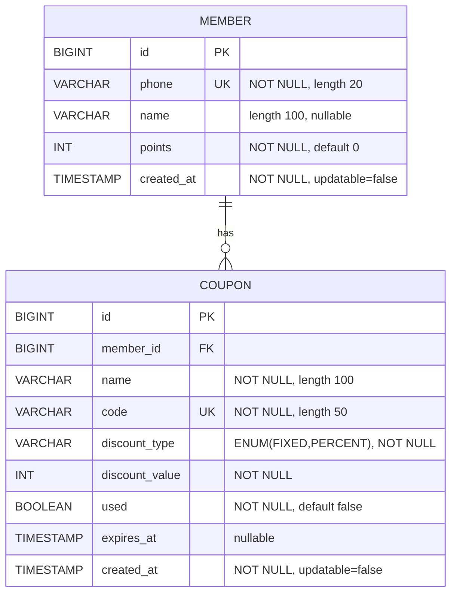

# MiniProject 엔티티 ERD

현재 Java 엔티티(`Member`, `Coupon`) 기준 ERD입니다.

---

## 관계 설명

- `Member (1) : Coupon (N)`
- 한 회원은 여러 쿠폰을 가질 수 있습니다.
- 각 쿠폰은 하나의 회원(`member_id`)에 속합니다.

---

## 코드 매핑 참고

- `Member` 엔티티: `src/main/java/com/cafe/kiosk/domain/Member.java`
- `Coupon` 엔티티: `src/main/java/com/cafe/kiosk/domain/Coupon.java`
